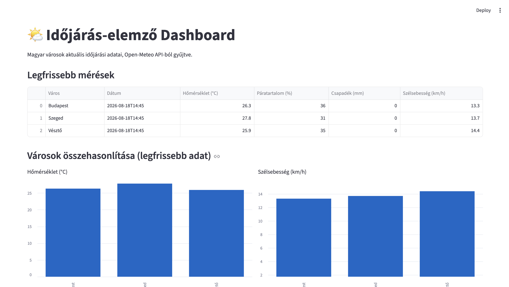
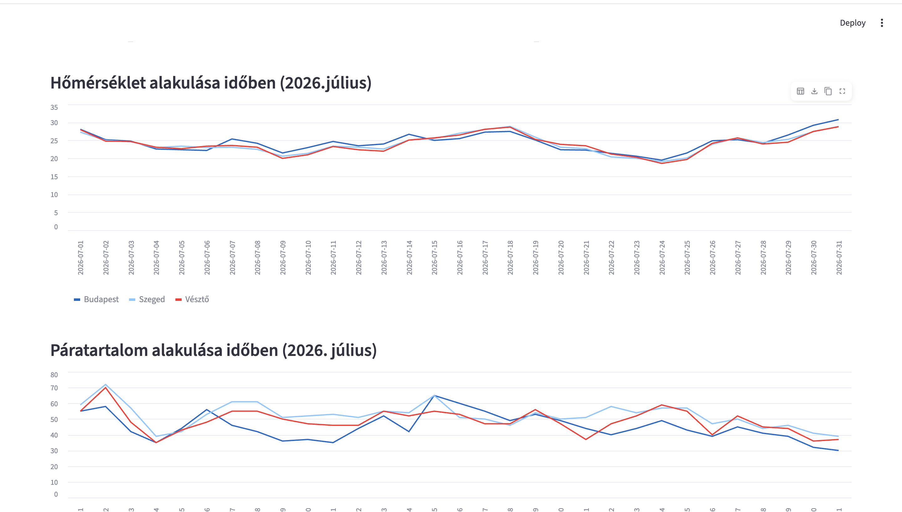

# 🌤️ Időjárás-elemző Dashboard

Python és SQL alapú adatprojekt, amely magyar városok időjárási adatait gyűjti,
tárolja, tisztítja és interaktív dashboardon jeleníti meg.

A projekt célja, hogy bemutassa egy egyszerű, de teljes adatfeldolgozási
folyamat (pipeline) felépítését: **adatgyűjtés → tárolás → adatminőség-ellenőrzés
→ vizualizáció**.

## Miről szól a projekt?

- Napi és aktuális időjárási adatokat gyűjt több magyar városra (Szeged,
  Budapest, Vésztő) az [Open-Meteo](https://open-meteo.com/) ingyenes API-jából
- Az adatokat egy relációs (SQLite) adatbázisban tárolja, két összekapcsolt
  táblában (`cities`, `weather_data`)
- Ellenőrzi és tisztítja az adatokat: duplikátumok kiszűrése, hiányzó és
  irreális (kiugró) értékek keresése
- Interaktív Streamlit dashboardon jeleníti meg az eredményt: táblázat a
  legfrissebb mérésekről, hőmérséklet-trend grafikon időben, városok
  összehasonlítása

## Használt technológiák

| Terület | Eszköz |
|---|---|
| Nyelv | Python |
| Adatbázis | SQLite (`sqlite3`) |
| Adatfeldolgozás | Pandas |
| Vizualizáció / Dashboard | Streamlit |
| API | Open-Meteo (aktuális + történelmi archívum) |

## Projekt felépítése

```
weather-data-dashboard/
├── fetch_weather.py       # aktuális időjárási adatok lekérése és mentése
├── fetch_historical.py    # történelmi (visszamenőleges) adatok lekérése
├── database.py             # adatbázis séma és beszúró függvények
├── data_quality.py          # duplikátum-, hiányzó- és kiugró érték-szűrés
├── dashboard.py               # Streamlit dashboard
├── check_db.py                 # gyors konzolos adatbázis-ellenőrző szkript
├── NOTES.md                     # NumPy / Pandas / sqlite3 cheat sheet
└── weather.db                    # SQLite adatbázis (a szkriptek hozzák létre)
```

## Futtatás

1. Klónozd a repót, majd hozz létre virtuális környezetet és telepítsd a
   csomagokat:
   ```
   pip install requests pandas matplotlib streamlit
   ```

2. Gyűjtsd be az adatokat:
   ```
   python fetch_weather.py
   python fetch_historical.py
   ```

3. Futtasd le az adatminőség-ellenőrzést:
   ```
   python data_quality.py
   ```

4. Indítsd el a dashboardot:
   ```
   streamlit run dashboard.py
   ```

   Ez megnyit egy böngészőablakot (`localhost:8501`) az interaktív
   dashboarddal.

## Adatminőség

A projekt kifejezetten kitér az adatminőség kérdésére: fejlesztés közben
kiderült, hogy a `fetch_weather.py` ismételt futtatása duplikált rekordokat
hozott létre az adatbázisban. Erre válaszul készült a `data_quality.py`
szkript, amely:

- kiszűri és törli a pontosan egyező duplikátum rekordokat
- ellenőrzi, van-e hiányzó (`NULL`) érték a mérésekben
- ellenőrzi, van-e irreális (fizikailag lehetetlen) hőmérséklet-érték

## Dashboard




## Fejlesztési megjegyzések

A projekt fejlesztése során felmerülő döntésekről és tanulási pontokról
(pl. miért SQLite, hogyan kapcsolódik össze a Python és az SQL) a
[NOTES.md](NOTES.md) fájlban írtam bővebben.
